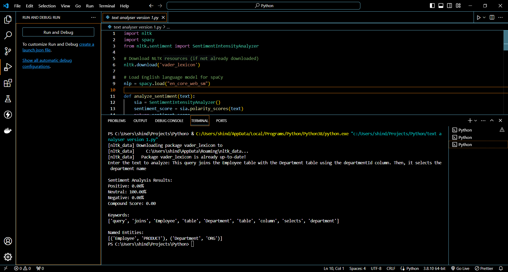
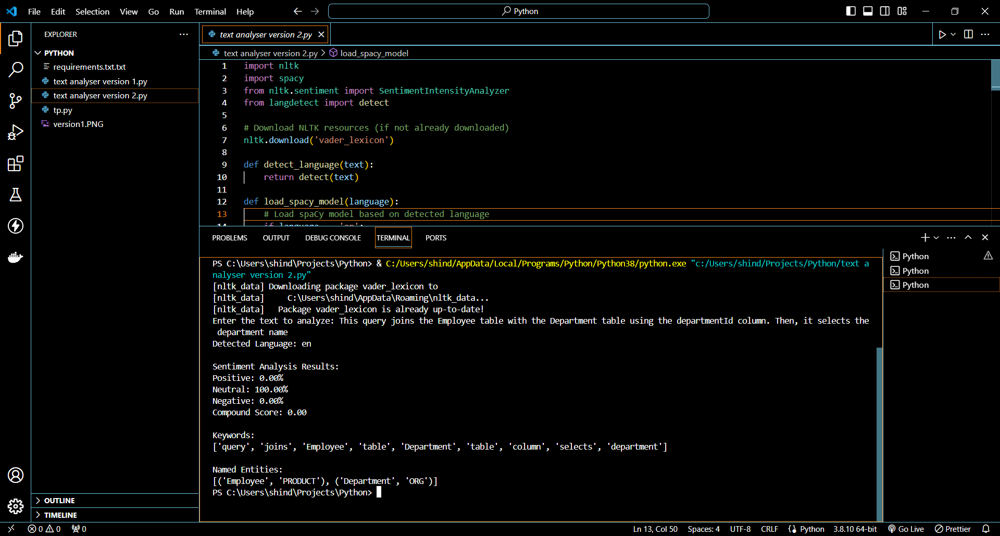

# Text-Analyser
<p >
  
</p>


Welcome to Text Analyser, a versatile tool for text analysis in Python!

Two Python versions for text analysis: V1 includes basic sentiment, keyword, and entity extraction using NLTK and spaCy. V2 adds enhanced sentiment, language detection, advanced keyword, and entity recognition. Explore insights in your text data!

<p align="center">
  
</p>


## Features

- **Version 1: Basic Analysis**
  - Sentiment Analysis using NLTK
  - Keyword Extraction with spaCy
  - Named Entity Recognition
<p align="left">
  
</p>
  
- **Version 2: Enhanced Analysis**
  - Advanced Sentiment Analysis
  - Language Detection
  - Improved Keyword Extraction
  - Enhanced Entity Recognition
<p align="left">
  
</p>

<p >
  
</p>

<p align="left">
  
</p>
## Getting Started

1. Clone the repository:
   ```bash
   git clone https://github.com/jayshinde10/Text-Analyser


## Contributing
Pull requests are welcome. For major changes, please open an issue first to discuss what you would like to change.

## License
This project is licensed under the MIT License - see the LICENSE file for details.


Feel free to customize the content, URLs, or file names to match your project. This single Markdown document provides a comprehensive overview of your Text-Analyzer project, including its features, usage instructions, contribution guidelines, and licensing information.
